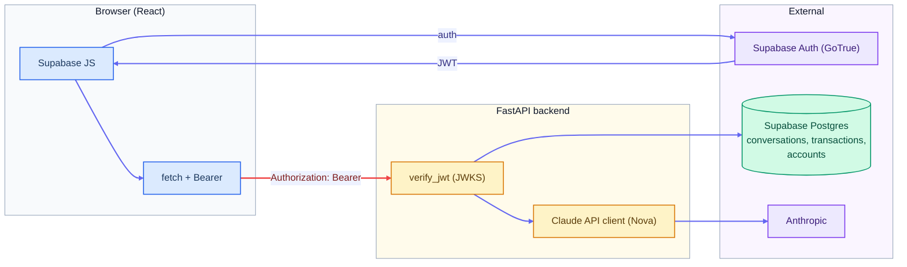

<div align="center">

<picture>
  <source media="(prefers-color-scheme: dark)" srcset="frontend/public/logos/Nova-Bank-Logo.svg">
  <source media="(prefers-color-scheme: light)" srcset="frontend/public/logos/Nova-Bank-Logo-Black.svg">
  
</picture>

<br />
<br />

**A full-stack banking demo — marketing site, authenticated dashboard, and an AI assistant powered by the Claude API.**

**[Live demo →](https://novabank-phi.vercel.app/)**

[](https://github.com/spolivin/novabank/actions/workflows/ci-backend.yml)
[](https://github.com/spolivin/novabank/actions/workflows/ci-frontend.yml)


</div>

---

## Overview

NovaBank is a portfolio project that models a modern retail bank end to end: a polished
marketing website, a Supabase-backed authentication flow, a personal dashboard with seeded
account data, and **Nova** — an AI banking assistant (Claude Sonnet) grounded in the bank's own product
catalogue and constrained to banking topics only.

The emphasis is on the parts that matter in production but rarely show up in demos: a
strict trust boundary between client and server, defence-in-depth on the API, persistent
conversation history, structured request logging, and a full CI + pre-commit pipeline.

- [Tech stack](#tech-stack)
- [Features](#features)
- [Architecture](#architecture)
- [API surface](#api-surface)
- [Security](#security)
- [Project layout](#project-layout)
- [Local setup](#local-setup)
- [Testing & quality](#testing--quality)
- [Command reference](#command-reference)

## Tech stack

| Layer         | Technology                                                                |
| ------------- | ------------------------------------------------------------------------- |
| **Frontend**  | React 19, TypeScript, Vite, Tailwind v4, Motion, React Router v7, Recharts |
| **Forms**     | React Hook Form + Zod                                                      |
| **Backend**   | FastAPI, Python 3.12, uv, SlowAPI                                          |
| **Auth + DB** | Supabase (Postgres, GoTrue auth)                                           |
| **AI**        | Claude Sonnet via the Anthropic API, with prompt caching                  |
| **Tooling**   | ESLint, Prettier, Ruff, pre-commit, pytest, Vitest                        |
| **Deploy**    | Vercel (frontend), Docker on Railway (backend)                            |

## Features

**Marketing site**
- Nine responsive marketing pages — Home, Personal, Cards, Loans, Business, About, Careers, Contact, Security
- Animated hero banners with preloaded/decoded imagery, partner marquee, testimonial carousel
- Product catalogue with tiered pricing for personal accounts and credit cards
- Open Graph metadata and link-preview imagery for social sharing

**Authenticated app**
- Sign up, log in, and self-service account deletion via Supabase Auth
- Protected routes gated on a valid session
- Personal dashboard backed by per-user Supabase data: summary cards (balance, monthly
  spending, savings) computed in Postgres from the `transactions` table, a user-set savings
  goal with a live progress bar, moving money to and from savings (checked against available
  funds and recorded in the transaction history), and a transaction table with an empty state

**Nova — the AI assistant**
- Chat grounded in NovaBank's product catalogue and company data via a system prompt
- **Persistent history** stored per user in Supabase and rehydrated on load
- Clear-history support and Markdown-rendered replies with day dividers
- **Prompt caching** on the system prompt to cut token cost on repeat turns
- Hard-constrained to banking topics; never emits financial advice or handles secrets

## Architecture

The frontend and backend are **fully separated** and communicate over a single, verified
trust boundary:



- The browser authenticates **directly** with Supabase and receives a JWT. That token is
  forwarded to FastAPI on every request as a `Bearer` credential.
- The backend **verifies the JWT signature** against Supabase's JWKS endpoint — it trusts
  the cryptographic signature, never the client's claim of who it is.
- Chat turns are persisted to a `conversations` table keyed by user ID. On each message the
  service records the user turn, replays recent history to Claude, and stores the reply —
  with orphan-cleanup if the model call fails.
- Every request is tagged with a short request ID and emitted as one canonical structured
  log line (JSON or human-readable), with noisy third-party HTTP loggers quieted by default.
- **All I/O on the request path is non-blocking.** The Anthropic and Supabase clients are
  the async variants, created once in the app's `lifespan`, handed to endpoints through
  FastAPI dependency injection (`Depends`), and closed on shutdown — so connection pools
  are bound to the serving event loop and no request is offloaded to a worker thread.

## API surface

All `/ai`, `/dashboard`, `/transactions` and `/users` routes require a valid Supabase JWT. Per-route rate limits are
enforced by SlowAPI.

| Method   | Endpoint        | Rate limit       | Description                                  |
| -------- | --------------- | ---------------- | -------------------------------------------- |
| `POST`   | `/ai/chat`      | 8 / min; 60 / day | Send a message to Nova and get a reply       |
| `GET`    | `/ai/history`   | 10 / min         | Fetch recent conversation history (optional `?limit=` 1–200) |
| `DELETE` | `/ai/history`   | 5 / min          | Clear the caller's conversation history (`204`) |
| `GET`    | `/dashboard/summary` | 30 / min | Fetch the caller's balance, monthly spending, savings goal and amount saved |
| `PUT`    | `/dashboard/savings-goal` | 10 / min | Set the caller's savings goal; returns the refreshed summary |
| `POST`   | `/dashboard/savings-transfer` | 10 / min | Move money to or from savings; `409` if funds are insufficient |
| `GET`    | `/transactions` | 30 / min         | Fetch the caller's recent transactions, newest first (optional `?limit=` 1–50) |
| `DELETE` | `/users/me`     | 3 / hour         | Permanently delete the caller's account (`204`) |
| `GET`    | `/health/api`   | unlimited        | Liveness probe                               |
| `GET`    | `/health/db`    | 60 / min         | Readiness probe (checks DB; optionally token-gated) |

Limits are keyed per user (the `sub` claim), falling back to the caller's IP for
unauthenticated requests. That IP is read from the direct connection by default;
`X-Forwarded-For` is trusted only when `TRUSTED_PROXY_COUNT` is set to the number
of proxies in front of the app, so a client cannot forge its rate-limit identity
with a spoofed header. `/ai/chat` carries a daily cap as well as a per-minute one:
it is the only endpoint that spends money, so it is bounded on both axes. The
liveness probe is deliberately unlimited, since a `429` there would read as
"unhealthy" to the platform.

## Security

Security is treated as a first-class concern rather than an afterthought:

- **JWT verified via JWKS** — the signature is checked against Supabase's public key, not merely decoded
- **Rate limiting** — per-user limits on every mutating and AI endpoint (see [API surface](#api-surface))
- **Spoof-resistant client IP** — the rate-limit key reads the real client IP only from trusted proxy hops (`TRUSTED_PROXY_COUNT`); a forged `X-Forwarded-For` cannot mint a fresh bucket or shift another user's
- **Gated DB health probe** — `/health/db` can require an `X-Health-Token` secret (`HEALTH_CHECK_TOKEN`), returning `404` to anonymous callers before any database query runs
- **Transfers applied once** — a savings transfer carries a per-request id, unique per user in the database, so a connection retry that already reached Postgres returns the current figures instead of moving the money twice
- **No-store on reads** — `Cache-Control: no-store` on the health and history endpoints keeps responses out of intermediary caches
- **HTTP body cap** — requests over 32 KB are rejected with `413` before reaching any handler. The body is *measured*, not taken on trust: a declared `Content-Length` is rejected on the fast path, and chunked requests (which omit it) are caught by the measured backstop
- **Payload limits** — messages capped at 500 characters (Pydantic); 10 rows (5 turns) of history are replayed to Claude per request, and 200 rows loaded for display
- **API docs disabled** — `/docs`, `/redoc`, and `/openapi.json` return `404` in all environments
- **Security headers** — `X-Content-Type-Options`, `X-Frame-Options: DENY`, `Referrer-Policy`, and `Content-Security-Policy: default-src 'none'` on every response, including rejected ones
- **Browser CSP** — the frontend ships its own strict policy: no `unsafe-eval`, no inline scripts, `base-uri`/`form-action` locked, `frame-ancestors 'none'`, and `connect-src` pinned to the exact Supabase and backend hosts so a successful XSS would have nowhere to exfiltrate to
- **Service key stays server-side** — only the anon (publishable) key ships in the browser bundle
- **CORS allowlist** — permitted origins come from an environment variable, never hardcoded
- **Prompt hardening** — Nova is instructed to refuse off-topic requests, never reveal its instructions, and never solicit passwords or card numbers
- **No secrets in the repo** — enforced by `detect-secrets` in the pre-commit pipeline

## Project layout

```
novabank/
├── frontend/                 # React 19 + Vite SPA
│   └── src/
│       ├── pages/            # Marketing pages, Login/Signup, Dashboard
│       ├── components/       # ui/, sections/, layout/
│       ├── context/          # Auth provider
│       ├── hooks/            # usePageTitle, ...
│       ├── lib/              # api.ts, supabase.ts
│       └── test/             # Vitest suites
├── backend/                  # FastAPI service
│   ├── routers/              # ai, user, health
│   ├── services/             # ai.py — Claude + persistence
│   ├── schemas/              # Pydantic request/response models
│   ├── dependencies/         # auth (JWKS), limiter, async Supabase + Anthropic clients
│   ├── data/                 # products.json, company.json (grounding)
│   ├── tests/                # pytest suites
│   └── Dockerfile
└── Makefile                  # dev / db / api task shortcuts
```

## Local setup

**Prerequisites:** Node.js, Python 3.12+, [uv](https://docs.astral.sh/uv/), the Supabase CLI, and Docker (optional).

```bash
# 1. Install frontend + backend dependencies and pre-commit hooks
make install

# 2. Start the local Supabase instance
make db-start

# 3. Create env files and fill them in
cp frontend/.env.example frontend/.env
cp backend/.env.example  backend/.env

# 4. Run the frontend dev server
make dev

# 5. Run the backend (in a separate terminal)
make api-start
```

The only value requiring a real secret locally is `ANTHROPIC_API_KEY`. Local Supabase dev
keys are printed by `make db-status` once the instance is running.

## Testing & quality

- **Backend** — `pytest` suite covering auth, rate limiting, body limits, logging, chat, history, and the client lifespan/injection wiring (`make api-test`)
- **Frontend** — `Vitest` + Testing Library suites for auth flows, the dashboard, and the AI assistant (`make test`)
- **Reproducible image builds** — the backend image installs from the committed `uv.lock` with a pinned uv version (`uv sync --locked`, dev dependencies omitted) and runs as a non-root user
- **CI** — separate GitHub Actions workflows for backend and frontend on every push
- **Pre-commit** — trailing-whitespace, EOF, merge-conflict, large-file and JSON/YAML checks, secret detection, Ruff format + lint, and Conventional Commits enforcement

Install hooks manually if needed:

```bash
cd backend && uv sync && uv run pre-commit install && uv run pre-commit install --hook-type commit-msg
```

Commit messages follow [Conventional Commits](https://www.conventionalcommits.org/):

```
type(scope): description
# types: feat, fix, refactor, chore, docs, style, test, perf, ci
```

## Command reference

| Command                  | Description                              |
| ------------------------ | ---------------------------------------- |
| `make dev`               | Start the frontend dev server            |
| `make build`             | Production build of the frontend         |
| `make lint`              | ESLint                                   |
| `make test`              | Frontend unit tests (Vitest)             |
| `make install`           | Install all deps + pre-commit hooks      |
| `make pre-commit`        | Run all hooks against the whole codebase |
| `make db-start` / `db-stop` | Start / stop local Supabase           |
| `make db-status`         | Show local Supabase keys and URLs        |
| `make db-reset`          | Reset the local database                 |
| `make api-start`         | Run the FastAPI backend (uvicorn)        |
| `make api-test`          | Run backend tests (pytest)               |
| `make api-format`        | Ruff format                              |
| `make api-lint`          | Ruff lint + autofix                      |
| `make api-build`         | Build the backend Docker image           |
| `make api-docker`        | Run the containerised backend            |
| `make api-logs`          | Tail Docker container logs               |
| `make api-grep q=error`  | Filter container logs by keyword         |
| `make api-stop`          | Stop the Docker container                |
</content>
